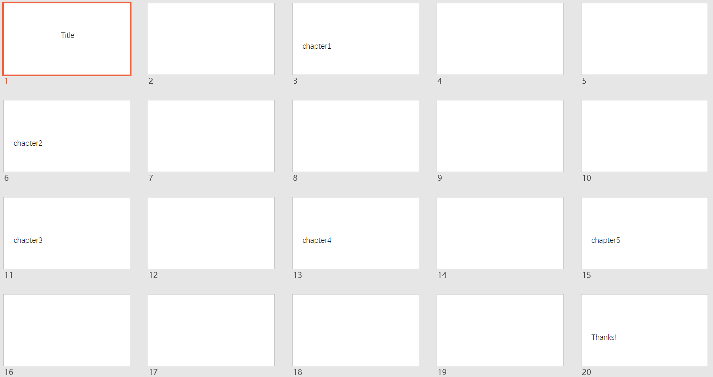
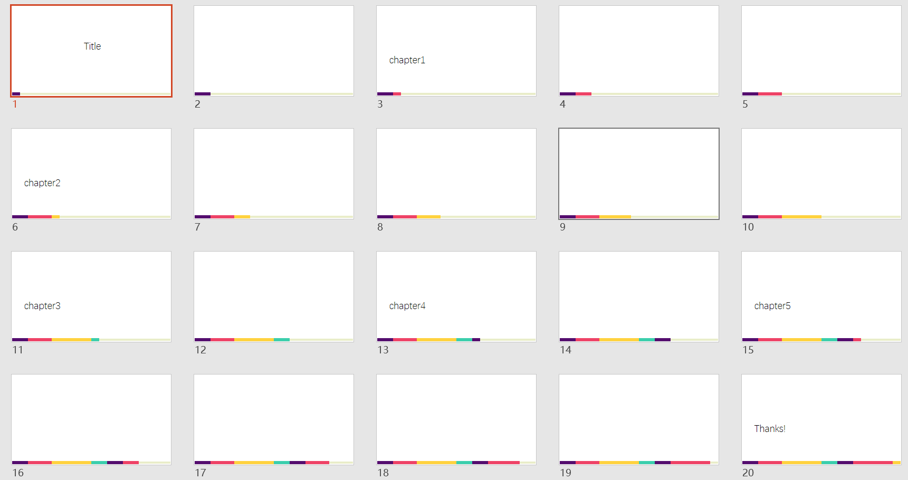

## Introduction

This repo contains easy-to-use Python scripts to **generate progress bars** flexibly for your PowerPoint presentation, in order to give the audience a good indication of the presentation structure. You may **configure the appearance** flexibly (such as the position, color, width or height, ......) by simply adjusting the `config.yaml` file. The script can also **auto-detect chapters** and assign different colors for each one. Below shows an example:

(overview of the original slide:)



(slide after running the script:)




## Getting Started

(Note: the code is tested in Python 3.10 environment)

1. Install Python packages

   ```
   pip install -r requirements.txt
   ```
2. Run script

   ```
   python run.py
   ```

3. You may check the result of `test.pptx`.

4. Then you may start on your own. Edit configuration parameters in `config.yaml` and re-run

   ```
   vim config.yaml
   ```

   ```
   python run.py
   ```


## Some design facts

1. Prefer YAML over JSON for config file (*implemented in v2.3*):

   * YAML looks cleaner

   * YAML may add comment, which is more user-friendly for configuration adjustments

2. Use of design pattern

   * Builder pattern


3. Progress bar positioning:

   ```
   down: [
   	(0, H-th, w0, th),     # w0 = ratio * W
   	(w0, H-th, w1, th),
   	(w0+w1, H-th, w2, th),
   	...
   ]
   ------------------------------------------
   up: [
   	(0, 0, w0, th),
   	(w0, 0, w1, th),
   	(w0+w1, 0, w2, th),
   	...
   ]
   ------------------------------------------
   left: [
   	(0, 0, th, h0),
   	(0, h0, th, h1),
   	(0, h0+h1, th, h2),
   	...
   ]
   ------------------------------------------
   right: [
   	(W-th, 0, th, h0),
   	(W-th, h0, th, h1),
   	(W-th, h0+h1, th, h2),
   	...
   ]

   (Note: `th` is the thickness of the progress bar)
   (Note: `W` is the width (horizontal direction) of the canvas)
   (Note: `H` is the height (vertical direction) of the canvas)
   (Note: `w0`/`w1` is the length of an segmentation when the progress bar is horizontally positioned)
   (Note: `h0`/`h1` is the length of an segmentation when the progress bar is vertically positioned)

   ```

4. Input validation in constructor while input anti-overwrite check in builder (not implemented)